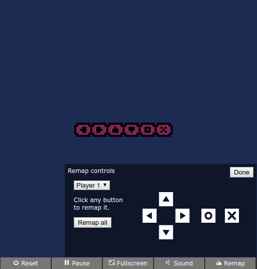

# nfig

A drop-in script that adds gamepad and keyboard settings to your exported [PICO-8][] game



[PICO-8]: http://www.lexaloffle.com/pico-8.php

## How do I use this?

Edit the HTML file for your game and add this line at the very end:

```html
<script src="https://cdn.jsdelivr.net/gh/codl/pico-nfig@1.0.1/lib/nfig.js" integrity="sha256-g5hO7r4Wj0Z51eaV73ATXK3yLGl7hqB30UN986DuCO0=" crossorigin="anonymous"></script>
```

## How do I use this without jsDelivr?

If you'd rather not use a CDN (for example, if you want your game to be playable offline) you can host nfig alongside your game.

Download [nfig.js](lib/nfig.js), put it in the same directory as your game, and add this line to the bottom of your game's HTML file:

```html
<script src="nfig.js"></script>
```

## Settings

There are a few settings you can add to your script tag to alter nfig's behaviour. They can be set by adding a `data-SETTING` attribute to nfig's script tag. For example, the following sets `players` to 4 and sets the `no-button` flag.

```html
<script
    data-players="4"
    data-no-button
    src="nfig.js"></script>
```

### `players`

**Number** from 1 to 8, default: 2

Sets the number of players that will be displayed in the dropdown menu. Set this to your expected number of players.

### `no-button`

**Flag**

If set, then nfig will not replace the default "Carts" button with its "Remap" button. Note that you will need to provide your players with another way to open the panel. nfig exposes a global `nfig_toggle()` method for you to use in this situation.

## Compatibility

nfig supports and has been tested against exports from PICO-8 v0.1.10C, in evergreen browsers (Chrome, Firefox, Edge)

It is compatible with [PICO-8 Styler][styler] (without gamepad support, see [#1][])

[styler]: https://seansleblanc.itch.io/pico-8-styler
[#1]: https://github.com/codl/pico-nfig/issues/1
