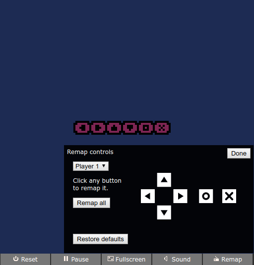

# nfig

A drop-in script that adds keyboard settings to your exported [PICO-8][] game



[PICO-8]: http://www.lexaloffle.com/pico-8.php

## How do I use this

Edit the HTML file for your game and add this line at the very end:

```javascript
<script src="https://cdn.rawgit.com/codl/pico-nfig/v0.0.0/lib/nfig.js"></script>
```

## How do I use this without rawgit

If you'd rather not use rawgit (for example, if you want your game to be playable offline) you can host nfig alongside your game.

Download [nfig.js](lib/nfig.js), put it in the same directory as your game, and add this line to the bottom of your game's HTML file:

```javascript
<script src="nfig.js"></script>
```
